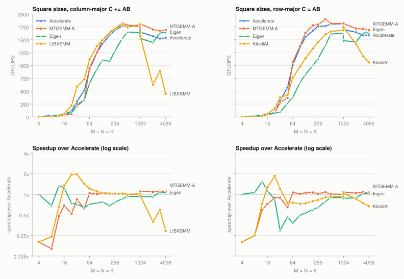
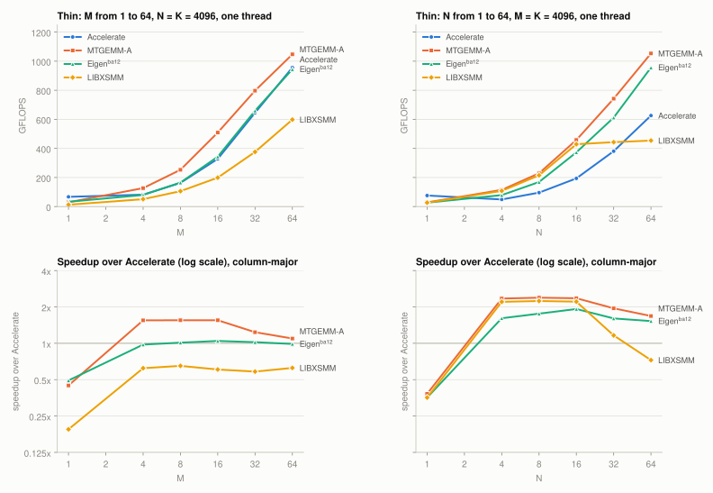
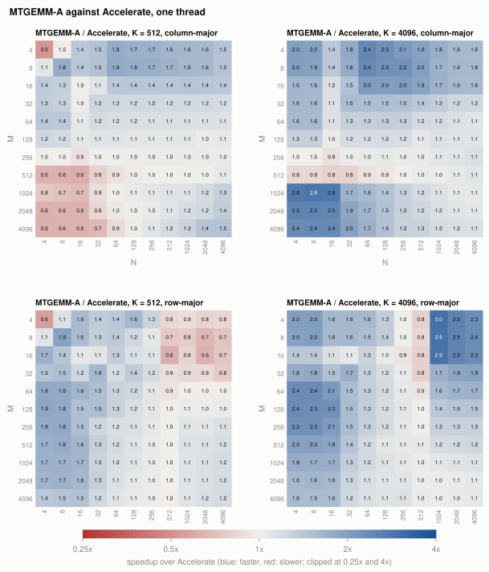
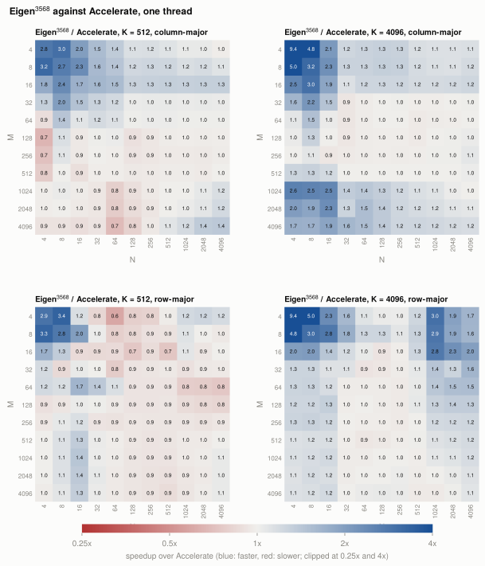

# MTGEMM-A

MTGEMM-A is an FP32 and FP64 matrix multiplication (GEMM) for the Apple M4 Pro that uses the Arm Scalable
Matrix Extension (SME). It is a standalone reproduction of the design in this paper:

> Chencheng Deng, Weiling Yang, Jianbin Fang, Dezun Dong. *Demystifying ARM SME to Optimize General Matrix
> Multiplications.* [arXiv:2512.21473](https://arxiv.org/abs/2512.21473).

The paper calls its library MpGEMM. The paper says that MpGEMM is open source, but it gives no link, and no
public code was found. Thus the claims of the paper cannot be checked with the authors' code. This project
builds the design from the text of the paper and measures it on the same machine class (M4 Pro). Then it
compares the results with the numbers in the paper, claim by claim.

The project has two configurations of one code base:

- **paper design**: the design as the paper describes it (benchmark option `paper`).
- **MTGEMM-A**: the paper design plus three changes that were found during the work (the library default).

## Contents

- [Results in short](#results-in-short)
- [Design as built](#design-as-built)
- [Deviations from the paper](#deviations-from-the-paper)
- [Build, test and benchmark](#build-test-and-benchmark)
- [Results](#results)
- [Claim-by-claim verdict](#claim-by-claim-verdict)
- [What each design element is worth](#what-each-design-element-is-worth)
- [What this means for the Eigen SME backend](#what-this-means-for-the-eigen-sme-backend)
- [Limitations](#limitations)
- [Future work](#future-work)
- [References](#references)

## Results in short

Geometric mean GFLOPS over the 24 workloads of the paper (DeepSeek and LLaMA shapes). "Paper" columns are the
paper's own numbers. The other columns are measured here. Accelerate runs with one thread for the
single-thread rows and with its default thread count for the two-thread rows.

| case | paper: MpGEMM | paper: Accelerate | Accelerate | Eigen master | paper design | MTGEMM-A | MTGEMM-A / Accelerate |
|---|---|---|---|---|---|---|---|
| fp32 row-major, 1 thread | 1321 | 1089 | 1128 | 940 | 1227 | **1405** | 1.25 |
| fp32 col-major, 1 thread | 1280 | 1085 | 1190 | 933 | 1136 | **1415** | 1.19 |
| fp32 row-major, 2 SME units | 2646 | 2138 | 2370 | - | 2398 | **2737** | 1.15 |
| fp32 col-major, 2 SME units | 2604 | 2142 | 2472 | - | 2211 | **2767** | 1.12 |
| fp64 row-major, 1 thread | 379 | 327 | 320 | - | 355 | **413** | 1.29 |
| fp64 row-major, 2 SME units | 772 | 653 | 676 | - | - | **811** | 1.20 |

"Eigen master" is Eigen's SME backend at commit ec8593a (one thread, measured in the session of
`results/ext/`, where Accelerate measured 1124 row-major and 1196 column-major).

- MTGEMM-A is 3-10% faster than the MpGEMM numbers in the paper, and 12-29% faster than Accelerate on this
  machine.
- The paper design, built as the paper describes it, does not reach the paper's numbers. It is 7-11% slower
  than MpGEMM in the paper. In column-major order it is 5% slower than Accelerate.
- Three changes close that gap: core-side L2 prefetch, four-row ZA moves for the C tiles, and four-row
  ZA moves in the packing of A. Together they give 1.15x (row-major) and 1.25x (column-major) over the
  paper design.
- Heap buffers (instead of stack buffers) and first-round online packing give almost no speedup here.
- Against the open-source SME libraries, built and run here: MTGEMM-A is 2.2x faster than LIBXSMM
  (column-major), 1.7x faster than KleidiAI and 3.7x faster than OpenBLAS (row-major). LIBXSMM measures within
  2% of the paper's LIBXSMM numbers, so the paper's baselines hold up. See
  [LIBXSMM, KleidiAI and OpenBLAS](#libxsmm-kleidiai-and-openblas).
- Across sizes and shapes MTGEMM-A is level with or faster than Accelerate from 128^3 up and on almost every
  shape with K = 4096. It is slower for squares below 64^3, for matrix-vector shapes (M or N = 1), and for one
  small and one large side at K = 512. See [Across sizes and shapes](#across-sizes-and-shapes).

## Design as built

The library has one entry point for each type (`include/mtgemm.h`):

```c++
void mt_sgemm(mt_order order, int M, int N, int K, float alpha, const float* A, int lda,
              const float* B, int ldb, float beta, float* C, int ldc, const mt_options* opt = nullptr);
void mt_dgemm(...);  // the same for double
```

It computes C = alpha A B + beta C with no transposition of A or B. `mt_options` switches each design
element on or off for the ablation study. The defaults give MTGEMM-A.

The source is small: `src/mtgemm.cpp` (packing, micro-kernels, loop nest, about 740 lines),
`src/model.cpp` (blocking model), `src/threads.cpp` (two-thread mode). The code uses the ACLE SME intrinsics
and a small amount of inline assembly.

### Six-level blocking from the analytical model

The loop nest is the Goto algorithm with six loops (paper Fig. 5):

1. L1: blocks of `mc` rows of A and C.
2. L2: blocks of `kc` along K. A is packed here.
3. L3: blocks of `nc` columns of B and C.
4. L4: panels of `mr` rows inside the A block.
5. L5: panels of `nr` columns inside the B block.
6. L6: the micro-kernel, over `kc`.

`src/model.cpp` selects `mc`, `nc` and `kc` with the model of the paper (Sec. 3.2):

- TLB bound (paper eq. 2): `Ta + 2 Tb + Tc < T_entry_total`, with 16 KB pages. This gives the largest `kc`.
- L2 bound (paper eq. 1): `mc kc + 2 kc nc + 2 mc nc < L2 / sizeof(T)`, with L2 = 8 MB. The paper's
  bandwidth measurements show that the SME unit keeps its full load bandwidth only up to 8 MB, although the
  L2 cache has 16 MB.
- Objective (paper eq. 3): the largest compute-to-memory ratio
  `CMR = 2 mc nc kc / (mc kc + kc nc + 2 mc nc)`.

The model searches a grid in steps of 16 (`kc`), `mr` (`mc`) and `nr` (`nc`). Then it balances each block
size so that the last block is not much smaller than the others. Examples for fp32: 4096^3 gives
mc = 592, nc = 448, kc = 832; 64 x 2112 x 7168 gives mc = 64, nc = 704, kc = 1200.

### Packing with on-the-fly transposition (A)

The micro-kernel needs A in column-major panels of `mr` rows. A is row-major, so the packing must transpose
it. The ZA array does the transposition (paper Fig. 6): rows of A go into the horizontal slices of the four
fp32 tiles (eight fp64 tiles), and the vertical slices come out as columns. One pass handles 16 rows by 64
columns (fp32). Predicates mask the tails.

- Paper design: one x4 load per row, then four `MOVA` instructions (one per tile).
- MTGEMM-A: four rows at a time. Four x4 loads with strided registers put the four rows of one tile into
  four consecutive Z registers, so that one `MOVA ... vg4` per tile moves four slices (`rows_in4`).
  Option `pack4`.

If alpha is not 1, the packing of A also multiplies by alpha.

### First-round online packing (B)

B is row-major and needs no transposition. The micro-kernel reads B directly from the source matrix in the
first L4 iteration (`ii == 0`) and writes each row to the packed buffer `Bc` while the `FMOPA` instructions
run. The next L4 iterations read `Bc`. Thus B has no separate packing pass (option `online`; `online=0`
packs B in a separate pass).

### Multi-vector (x4) loads

All full-width loads and stores of A, B and C use the SME2 four-register forms (`ld1w {z0-z3}`,
`st1w {z0-z3}`), in the packing and in the micro-kernel. Option `x4=0` replaces each with four
single-register instructions.

### ZA tile use and micro-kernels

- Main micro-kernel: 16 x 64 for fp32 (1 x 4 tiles of 16 x 16) and 8 x 64 for fp64 (1 x 8 tiles of 8 x 8).
  One A vector and one row of four B vectors give four `FMOPA`s to four different tiles. The loop is
  unrolled by four along K: one x4 load of A gives four K steps (paper Alg. 1).
- N tail of at least half a panel (MTGEMM-A only): one half-width kernel with two tile rows, 32 x 32 for fp32
  (2 x 2 tiles) and 16 x 32 for fp64 (2 x 4 tiles). The edge kernel below loads and stores C one vector per
  row, and at short depths that cost is not repaid: 96^3 row-major went from 929 to 1340 GFLOPS with this
  kernel (Accelerate: 1366). None of the paper's 24 workloads has an N tail, so their results do not change.
- Edge micro-kernel for the rest of the N tail: 64 x 16 for fp32 (4 x 1 tiles), 64 x 8 for fp64 (8 x 1
  tiles). All tiles stay in use.
- M tails use fewer tile rows. Rows outside the matrix are zero in the packed panel and are not stored.
- Option `shape=1` selects a 32 x 32 kernel (2 x 2 tiles), which is the layout of OpenBLAS and KleidiAI,
  for the ablation.

C tiles move between memory and ZA at the start and at the end of each micro-kernel (option `cdirect`):

- `cdirect=0` (paper design): x4 loads into Z registers, then one `MOVA` per slice.
- `cdirect=1`: `ld1w`/`st1w` directly to and from ZA slices.
- `cdirect=2` (MTGEMM-A): four rows with strided-register x4 loads, one `MOVA ... vg4` per tile
  (`rows_in4`, `rows_out4`).

If beta is 0, the kernel zeroes ZA and does not read C. If beta is 1, it loads C. Other values scale C
after the load.

### Heap buffers

The packed buffers `Ac` and `Bc` are on the heap: one 16 KB-aligned buffer per thread, which stays allocated
between calls (so that the timings include no page faults). The paper says that stack buffers cause stalls,
because of memory ordering between the core and the SME unit. Option `heap=0` puts the buffers on the stack
(`alloca`) for the ablation.

### Prefetching (MTGEMM-A only)

The paper does not prefetch. MTGEMM-A adds core-side `prfm pldl2keep` instructions (option `prefetch`,
a bit mask):

- 1: the next 64 columns of the A rows that the packing transposes.
- 2: the B rows 8 rows ahead during the online packing.
- 4: the next C tile while the current one computes.

The SME unit reads through the shared L2 cache. The core prefetch brings the data into L2 before the SME
unit needs it. `results/ubench_2026-09-22.txt` shows the effect on a strided 16-row read: 105 GB/s without
prefetch, 146 GB/s with it.

### Two-thread mode (one thread per SME unit)

The M4 Pro has two performance clusters with one SME unit each. `threads=2` splits the problem into two
halves along the larger of M and N (at a multiple of 64 rows or columns). The calling thread computes one
half. One persistent worker thread computes the other half. Both threads run at QoS class
user-interactive, so that macOS puts them on performance cores. Each thread has its own packed buffers.
macOS has no interface to pin a thread to a cluster, so the scheduler must put the two threads on
different clusters.

### Column-major order

A column-major problem is the row-major problem C^T = B^T A^T. The library swaps A and B, and M and N, and
then runs the row-major code. This is the same as the paper's 64 x 16 main kernel for column-major order.

## Deviations from the paper

| item | paper | MTGEMM-A | reason |
|---|---|---|---|
| code | native SME assembly | ACLE intrinsics, inline assembly only for the strided-register `MOVA vg4` moves | easier to read and to change; the compiler schedules the loop |
| model solution | Lagrange multipliers | grid search, then balanced block sizes | the grid search is exact on the integer grid and cheap; balancing avoids a small last block |
| TLB entries | not stated for M4 | 160 (assumed; the published value for the M1 Firestorm core) | no published M4 value was found |
| C tile I/O | x4 load, then one `MOVA` per slice | four-row `MOVA vg4` (`cdirect=2`) | 1.03-1.04x faster |
| A packing | one row, four `MOVA`s | four rows, one `MOVA vg4` per tile (`pack4=1`) | 1.00x (row-major) to 1.06x (column-major) |
| prefetch | none | core L2 prefetch of A, B and C | 1.12x (row-major) to 1.20x (column-major) |
| software pipelining | explicit, unroll by 16 | unroll by 4, compiler schedules | not tuned further |
| threads | "at most two threads per cluster", work split over mc x nc blocks | one thread per cluster, one split of C in two halves | one SME unit per cluster; a second thread on the same unit only competes for it |
| timing | arithmetic mean of 5 runs | minimum of 5 trials, each at least 50 ms, after one warm-up call | lower noise on a shared machine; the same method for all libraries here |
| machine | M4 Pro, 10 P-cores (two clusters of 5), macOS 15.1, AppleClang 16 | M4 Pro, 8 P-cores (two clusters of 4), macOS 27.0, Apple clang 21 | the machine that was available; both have two P-cluster SME units |
| mixed precision (paper Sec. 4: FP16, INT8) | yes | no | out of scope; this project checks the FP32/FP64 claims |

## Build, test and benchmark

Requirements: an Apple M4 (or other SME2 machine with SVL 512 and FEAT_SME_F64F64), Apple clang, Python 3.
Build flags (in the `Makefile`): `-std=c++17 -O3 -DNDEBUG -march=armv8.6-a+sme2+sme-f64f64`.

```sh
make            # build/libmtgemm.a, build/test_gemm, build/bench, build/ubench
make test       # correctness tests
make gbench     # optional: Google Benchmark cross-check (downloads benchmark v1.9.1 into build/)
make test_ext   # optional: fetch and build LIBXSMM and KleidiAI, check them against Accelerate
make test_eigen # optional: fetch Eigen master, check its SME GEMM against Accelerate
./tools/plots.py  # charts in docs/ from results/ext (a uv script: needs uv, fetches matplotlib)
```

`make bench_ext` and `make test_ext` run `third_party/build.sh`. The script clones LIBXSMM and KleidiAI at
pinned commits into `third_party/src/` and builds them into `third_party/install/`; both directories are
ignored by git. `make test_ext` checks both libraries against Accelerate on every benchmark shape, and it
checks that each call changes C.

`make test` compares the result with a double-precision reference on fixed shapes, on all combinations of
the options (2304 checks), and on 900 random cases with tails, padded leading dimensions, several alpha and
beta values, and both orders. It also checks that no element outside C changes.

### Benchmarks

```sh
# bench <squares|paper|irr|all|MxNxK> <row|col> <accel|mt> [f64] [paper] [option=value ...]
VECLIB_MAXIMUM_THREADS=1 ./build/bench all row mt              # MTGEMM-A, squares and the 24 workloads
VECLIB_MAXIMUM_THREADS=1 ./build/bench all row mt paper        # paper design
VECLIB_MAXIMUM_THREADS=1 ./build/bench all col accel           # Accelerate, one thread
./build/bench all row mt threads=2                             # two SME units
VECLIB_MAXIMUM_THREADS=1 ./build/bench paper row mt f64        # fp64
./build/bench all row mt online=0                              # one ablation
```

Options: `online`, `x4`, `heap`, `model` (1 = model, 0 = fixed kc = mc = 256, nc = 1024, 2 = no cache
blocking), `shape`, `cdirect`, `pack4`, `pf` (prefetch mask), `threads`, `mc`, `nc`, `kc`, `beta`, `ms`,
`trials`, `ids=a-b`. Row-major runs use beta = 0 and column-major runs use beta = 1, as in the paper. Each
MTGEMM-A run also checks one result against Accelerate (`err/sqrtK` column).

```sh
# bench_ext <set> <libxsmm|kleidiai> [ids=a-b] [ms=50] [trials=5] [check]
# bench_eigen <set> <row|col> [ids=a-b] [ms=50] [trials=5] [check]
# set: squares, paper, all, irr, small (squares 4-384), thin (M or N 1-64), grid512, grid4096, MxNxK
VECLIB_MAXIMUM_THREADS=1 ./build/bench_ext all libxsmm          # column-major, C += A*B
VECLIB_MAXIMUM_THREADS=1 ./build/bench_ext all kleidiai         # row-major, C = A*B
```

`bench_ext` sets up the two libraries as the paper does (Sec. 5.1.3). LIBXSMM runs column-major
`C += A*B`: one JIT kernel from `libxsmm_dispatch_gemm` covers the whole problem. KleidiAI runs row-major
`C = A*B` with its SME2 FP32 kernel `matmul_clamp_f32_f32p2vlx1_f32p2vlx1biasf32_sme2_mopa`. Each timed call
packs both operands with KleidiAI's own packers (`lhs_pack_f32p2vlx1_f32_sme`,
`rhs_pack_kxn_f32p2vlx1biasf32_f32_f32_sme`) and then runs the kernel. The packed buffers are allocated once,
outside the timing. This is the only FP32 SME kernel that KleidiAI builds for this platform.

`bench/run_all.sh <outdir> <label> <args>` waits until the one-minute load is below 4, runs one benchmark and
writes the load before and after into the result file. `BIN=./build/bench_ext` selects the second binary. Run one benchmark at a time: two benchmarks at the
same time share the SME units and the L2 caches.

`./build/ubench` runs the microbenchmarks (FMOPA peak by tile count, SME load bandwidth by footprint and
load width, strided reads with prefetch, core stores during SME loads).

`bash tools/report.sh` writes all tables into `results/final/tables.md` from the raw result files.

### Layout

| path | content |
|---|---|
| `include/mtgemm.h` | API and options |
| `src/` | library |
| `tests/test_gemm.cpp` | correctness tests |
| `bench/bench.cpp`, `bench/gbench.cpp`, `bench/ubench.cpp` | benchmarks |
| `bench/bench_ext.cpp`, `bench/bench_eigen.cpp`, `third_party/build.sh` | LIBXSMM, KleidiAI and Eigen benchmarks, fetch-and-build script |
| `bench/shapes.h` | shape sets shared by all benchmarks |
| `docs/` | charts (light and dark SVG), drawn by `tools/plots.py` |
| `results/ext/` | LIBXSMM, KleidiAI, Eigen, Accelerate and MTGEMM-A, all shape sets (2026-09-22/23, load 1.7-3.3) |
| `bench/baseline/` | Eigen and OpenBLAS baseline programs and their outputs |
| `results/final/` | final raw results (2026-09-22) and `tables.md` |
| `results/r1`-`r3` | earlier rounds, kept for the record |
| `results/paper_numbers.csv` | numbers of the paper, read from its figures (see below) |
| `tools/` | table scripts, the figure reader |

### Numbers from the paper

The paper gives most results only as bar charts. `results/paper_numbers.csv` has the bar heights of the
figures `singlerowmajor`, `singlecolmajor`, `multirowmajor`, `multicolmajor` and `singlerowmajor-fp64`.
`tools/pdfbars.py` reads them from the vector PDFs in the arXiv source of the paper and converts them to
GFLOPS with the axis ticks. `tools/paper_numbers.py <figs dir>` regenerates the file from a local download
of the arXiv source; the source itself is not in this repository. The geometric means of the extracted
values agree with the averages in the text of the paper: 1.21x and 1.18x over Accelerate for one SME unit,
1.24x and 1.22x for two units, 1.18x for fp64 with two units.

## Results

Machine: Apple M4 Pro, 8 performance cores in two clusters of 4 (two SME units, SVL 512 bits), 4 efficiency
cores, 16 MB L2 per P-cluster, 48 GB, macOS 27.0, Apple clang 21. All results in GFLOPS, higher is better.
Full per-shape tables: [`results/final/tables.md`](results/final/tables.md).

The workloads are the 24 shapes of the paper (Table III): IDs 1-6 have M = 64, IDs 7-12 have M = 128,
IDs 13-18 have M = 4096, IDs 19-24 have N = 256. The tables below give the geometric mean of each group.

### Across sizes and shapes

The paper's 24 workloads are a selection. These charts give the rough picture against Accelerate over a
wide range of sizes and shapes: square sizes from 4^3 to 4096^3, thin shapes with M or N from 1 to 64, and a
grid of every M and N from 4 to 4096 (powers of two) at K = 512 and K = 4096. fp32, one thread, minimum of
five trials, the same harness for every library (`results/ext/`, load 1.7-3.3). `tools/plots.py` draws them.

<picture>
  <source media="(prefers-color-scheme: dark)" srcset="docs/squares-dark.svg">
  
</picture>

- MTGEMM-A is slower than Accelerate for squares below 64^3 (0.16x-0.9x). From 64^3 up it is level or up to
  1.1x faster. At the small sizes the fixed cost of the SME path (streaming mode, ZA setup, packing)
  dominates.
- LIBXSMM is the fastest library from 16^3 to 48^3 (up to 2x Accelerate) and falls to 0.3x-0.6x from 2048^3 up.
- Eigen master is faster than Accelerate at 12^3-16^3 (1.1x-1.6x), at 0.3x-0.9x from 24^3 to 192^3 (lowest
  in row-major order), and at 0.85x-1.1x from 256^3 up.

<picture>
  <source media="(prefers-color-scheme: dark)" srcset="docs/thin-dark.svg">
  
</picture>

- With one side from 4 to 32 and the other two at 4096, MTGEMM-A is 1.2x-2.4x faster than Accelerate. With one
  side equal to 1 (a matrix-vector product) it is at 0.4x: that case needs a GEMV, not a GEMM kernel.

<picture>
  <source media="(prefers-color-scheme: dark)" srcset="docs/grid_mtgemm-dark.svg">
  
</picture>

- K = 4096: MTGEMM-A is faster almost everywhere, up to 3.0x where one side is small. The exceptions are a few
  cells at 0.8x-0.9x: M = 512 with N <= 32 (column-major) and M <= 32 with N = 512 (row-major).
- K = 512: MTGEMM-A is at 0.6x-0.9x where one side is small (up to 32) and the other is large (512 and up):
  column-major with small N, row-major with small M.
  column-major is solved as the transposed row-major problem. The large-by-large region is at 1.0x-1.5x.
- The 4 x 4 corner is at 0.5x in both orders: a 4 x 4 result does not repay entering streaming mode.

### fp32, one thread, row-major (beta = 0)

| group | paper: MpGEMM | paper: Accelerate | Accelerate | paper design | MTGEMM-A | MTGEMM-A / paper MpGEMM | MTGEMM-A / Accelerate |
|---|---|---|---|---|---|---|---|
| M = 64 (IDs 1-6) | 991 | 708 | 711 | 914 | 1070 | 1.08 | 1.50 |
| M = 128 (7-12) | 1258 | 989 | 1008 | 1178 | 1348 | 1.07 | 1.34 |
| M = 4096 (13-18) | 1576 | 1548 | 1597 | 1506 | 1681 | 1.07 | 1.05 |
| N = 256 (19-24) | 1551 | 1297 | 1412 | 1396 | 1607 | 1.04 | 1.14 |
| all 24 | 1321 | 1089 | 1128 | 1227 | **1405** | 1.06 | 1.25 |
| squares 512-4096 | - | - | 1707 | 1568 | 1753 | - | 1.03 |

### fp32, one thread, column-major (beta = 1)

| group | paper: MpGEMM | paper: Accelerate | Accelerate | Eigen SME (!3164) | paper design | MTGEMM-A | MTGEMM-A / paper MpGEMM | MTGEMM-A / Accelerate |
|---|---|---|---|---|---|---|---|---|
| M = 64 (IDs 1-6) | 1018 | 763 | 937 | 529 | 790 | 1105 | 1.09 | 1.18 |
| M = 128 (7-12) | 1279 | 1037 | 1189 | 813 | 1070 | 1387 | 1.08 | 1.17 |
| M = 4096 (13-18) | 1430 | 1422 | 1455 | 1604 | 1440 | 1663 | 1.16 | 1.14 |
| N = 256 (19-24) | 1443 | 1231 | 1238 | 1275 | 1365 | 1571 | 1.09 | 1.27 |
| all 24 | 1280 | 1085 | 1190 | 968 | 1136 | **1415** | 1.10 | 1.19 |
| squares 512-4096 | - | - | 1616 | - | 1576 | 1730 | - | 1.07 |

"Eigen SME (!3164)" is explained in [What this means for the Eigen SME backend](#what-this-means-for-the-eigen-sme-backend).

The best single-thread result is 1760 GFLOPS (ID 13, row-major). The FMOPA peak of one SME unit is
2008 GFLOPS (microbenchmark), so this is 88% of peak.

### fp32, two SME units

Accelerate uses its default thread count here. MTGEMM-A uses two threads, one for each SME unit.

| group | paper: MpGEMM | paper: Accelerate | Accelerate | paper design 2T | MTGEMM-A 2T | MTGEMM-A 2T / Accelerate |
|---|---|---|---|---|---|---|
| row-major, M = 64 | 1994 | 1398 | 1457 | 1783 | 2036 | 1.40 |
| row-major, M = 128 | 2508 | 1960 | 2127 | 2313 | 2602 | 1.22 |
| row-major, M = 4096 | 3144 | 3001 | 3303 | 2989 | 3366 | 1.02 |
| row-major, N = 256 | 3117 | 2543 | 3081 | 2685 | 3146 | 1.02 |
| row-major, all 24 | 2646 | 2138 | 2370 | 2398 | **2737** | 1.15 |
| column-major, M = 64 | 2058 | 1507 | 1904 | 1487 | 2131 | 1.12 |
| column-major, M = 128 | 2586 | 2056 | 2534 | 2090 | 2702 | 1.07 |
| column-major, M = 4096 | 2915 | 2798 | 3026 | 2850 | 3295 | 1.09 |
| column-major, N = 256 | 2963 | 2427 | 2558 | 2697 | 3089 | 1.21 |
| column-major, all 24 | 2604 | 2142 | 2472 | 2211 | **2767** | 1.12 |

Two threads give 1.95x (row-major) and 1.96x (column-major) over one thread for both configurations.
On the square sizes the two-thread mode is not reliable: 512^3 gains nothing, and some runs at 1000^3 and
1024^3 fall to the one-thread level (see [Limitations](#limitations)).

### fp64, row-major (beta = 0)

| group | paper: MpGEMM 1T | paper: Accel 1T | Accel 1T | paper design 1T | MTGEMM-A 1T | paper: MpGEMM par. | paper: Accel par. | Accel (all threads) | MTGEMM-A 2T | MTGEMM-A 1T / Accel 1T | MTGEMM-A 2T / Accel (all threads) |
|---|---|---|---|---|---|---|---|---|---|---|---|
| M = 64 | 316 | 247 | 232 | 299 | 380 | 646 | 492 | 486 | 704 | 1.64 | 1.45 |
| M = 128 | 370 | 313 | 295 | 354 | 422 | 750 | 622 | 622 | 798 | 1.43 | 1.28 |
| M = 4096 | 425 | 394 | 388 | 402 | 434 | 870 | 788 | 829 | 900 | 1.12 | 1.09 |
| N = 256 | 417 | 375 | 393 | 374 | 419 | 842 | 753 | 832 | 855 | 1.07 | 1.03 |
| all 24 | 379 | 327 | 320 | 355 | **413** | 772 | 653 | 676 | **811** | 1.29 | 1.20 |

The fp64 FMOPA peak is 502 GFLOPS for one unit, so MTGEMM-A reaches 82% of peak on average.

### Irregular shapes (fp32, row-major, K = 25600)

| M = N | Accelerate | paper design | MTGEMM-A | MTGEMM-A / Accelerate |
|---|---|---|---|---|
| 80 | 714 | 1021 | 1167 | 1.63 |
| 110 | 837 | 1017 | 1206 | 1.44 |
| 140 | 944 | 1049 | 1255 | 1.33 |
| 170 | 999 | 987 | 1206 | 1.21 |
| 200 | 1080 | 1041 | 1277 | 1.18 |

### LIBXSMM, KleidiAI and OpenBLAS

These runs were made in one session at load 2-3, together with a new run of Accelerate and MTGEMM-A
(`results/ext/`). Geometric mean GFLOPS per group of the paper's workloads, fp32, one thread:

| group | LIBXSMM (col) | Accelerate (col) | MTGEMM-A (col) | KleidiAI (row) | OpenBLAS (row) | Accelerate (row) | MTGEMM-A (row) | MTGEMM-A / Accelerate (col) | MTGEMM-A / Accelerate (row) |
|---|---|---|---|---|---|---|---|---|---|
| M = 64 (IDs 1-6) | 671 | 935 | 1098 | 605 | 420 | 704 | 1069 | 1.17 | 1.52 |
| M = 128 (IDs 7-12) | 924 | 1192 | 1376 | 751 | 417 | 1002 | 1347 | 1.15 | 1.34 |
| M = 4096 (IDs 13-18) | 552 | 1473 | 1680 | 980 | 114 | 1595 | 1695 | 1.14 | 1.06 |
| N = 256 (IDs 19-24) | 499 | 1245 | 1569 | 1119 | 1044 | 1422 | 1597 | 1.26 | 1.12 |
| all 24 | 643 | 1196 | 1413 | 840 | 380 | 1124 | 1405 | 1.18 | 1.25 |
| squares 512-4096 | 1037 | 1633 | 1722 | 1432 | 762 | 1687 | 1749 | 1.05 | 1.04 |

The paper's numbers for the same libraries, geometric mean over the 24 workloads: LIBXSMM 657 (col),
KleidiAI 564 and OpenBLAS 464 (row).

- LIBXSMM: 643 here against 657 in the paper, a match within 2%. It is fast when its unpacked operand fits in
  L2 (IDs 2, 3, 8, 9, 15 and squares up to 1024) and falls to 450-600 GFLOPS when it does not, as the paper
  explains.
- KleidiAI: 840 here against 564 in the paper, 1.5x faster. The version here is from September 2026 and is
  newer than the paper's. The timing here also leaves out the allocation of the packed buffers; the paper does
  not say whether its timing includes it.
- OpenBLAS: the run from `bench/baseline/` (0.3.34, Homebrew, one thread). OpenBLAS uses SME only in a
  direct SME1 kernel for row-major `C = A*B` with contiguous operands, and only for sizes that its heuristic
  accepts. The M = 4096 workloads fall back to NEON here (114 GFLOPS), which the paper's OpenBLAS numbers do
  not show (422-533).
- The paper claims 1.95x, 2.34x and 2.85x for MpGEMM over LIBXSMM, KleidiAI and OpenBLAS. MTGEMM-A gets 2.20x,
  1.67x and 3.70x here. The KleidiAI ratio is lower because KleidiAI is faster than the paper measured.
- All results match Accelerate bit for bit (`err/sqrtK` = 0) on every shape.

Irregular shapes (K = 25600, M = N = 80-200), GFLOPS: LIBXSMM (col) 535, 502, 369, 349, 475; KleidiAI (row)
402, 484, 524, 579, 617; MTGEMM-A (row) 1167, 1206, 1255, 1206, 1277; Accelerate (row) 714, 837, 944, 999, 1080.
The full per-shape tables are in `results/final/tables.md`.

### Harness cross-check

`results/final/gbench.txt` times six shapes with Google Benchmark. The values agree with `bench` within
about 2% (for example, 4096^3 row-major: 1682 against 1672 GFLOPS).

### Ablation

Each row switches off one element and keeps the others. The values are the geometric mean over the 24
workloads and over the six square sizes, relative to the full configuration (1.00). Values below 1.00 mean
that the element helps. Raw data: `results/final/abl_*` (from MTGEMM-A) and `results/final/pabl_*` (from the
paper design).

| element switched off | option | from MTGEMM-A, row: 24 / squares | from MTGEMM-A, col: 24 / squares | from paper design, row: 24 / squares | from paper design, col: 24 / squares |
|---|---|---|---|---|---|
| online packing of B | `online=0` | 0.98 / 0.99 | 0.99 / 0.98 | 1.01 / 1.01 | 0.97 / 0.99 |
| x4 loads | `x4=0` | 0.94 / 0.94 | 0.92 / 0.94 | 0.95 / 1.02 | 1.00 / 0.98 |
| heap buffers (stack instead) | `heap=0` | 1.00 / 0.99 | 1.00 / 1.00 | 1.02 / 1.02 | 1.00 / 0.99 |
| model blocking (fixed 256/1024/256 instead) | `model=0` | 0.93 / 0.90 | 0.92 / 0.90 | 0.85 / 0.89 | 0.87 / 0.86 |
| cache blocking (none) | `model=2` | 0.58 / 0.75 | 0.59 / 0.76 | 0.66 / 0.87 | 0.70 / 0.83 |
| 16 x 64 kernel (32 x 32 instead) | `shape=1` | 0.85 / 0.94 | 0.91 / 0.89 | 0.77 / 0.83 | 0.85 / 0.78 |
| four-row A packing | `pack4=0` | 1.00 / 1.00 | 0.95 / 0.96 | (off) | (off) |
| four-row C I/O (paper's C I/O instead) | `cdirect=0` | 0.96 / 0.95 | 0.97 / 0.94 | (off) | (off) |
| four-row C I/O (direct ZA slice I/O instead) | `cdirect=1` | 1.00 / 0.99 | 1.00 / 0.99 | (off) | (off) |
| all prefetch | `pf=0` | 0.90 / 0.96 | 0.83 / 0.95 | (off) | (off) |
| prefetch of A | `pf=6` | 0.97 / 0.99 | 0.89 / 0.99 | (off) | (off) |
| prefetch of B | `pf=5` | 0.96 / 1.00 | 0.98 / 0.99 | (off) | (off) |
| prefetch of C | `pf=3` | 0.96 / 0.97 | 0.94 / 0.96 | (off) | (off) |

By group (from MTGEMM-A; M = 64 / M = 128 / M = 4096 / N = 256):

| element switched off | row-major | column-major |
|---|---|---|
| online packing | 0.93 / 0.97 / 1.02 / 0.99 | 0.99 / 0.99 / 1.00 / 0.98 |
| x4 loads | 0.93 / 0.94 / 0.96 / 0.93 | 0.87 / 0.89 / 0.96 / 0.95 |
| model blocking | 0.97 / 0.96 / 0.87 / 0.92 | 0.92 / 0.94 / 0.89 / 0.93 |
| cache blocking | 0.56 / 0.51 / 0.49 / 0.82 | 0.66 / 0.70 / 0.58 / 0.47 |
| 16 x 64 kernel | 0.73 / 0.80 / 0.91 / 1.01 | 0.99 / 0.98 / 0.86 / 0.83 |
| four-row A packing | 1.00 / 1.00 / 1.01 / 0.98 | 0.92 / 0.92 / 0.97 / 0.98 |
| four-row C I/O | 0.96 / 0.95 / 0.98 / 0.96 | 0.96 / 0.96 / 0.98 / 0.98 |
| prefetch of A | 0.99 / 0.99 / 1.01 / 0.90 | 0.77 / 0.84 / 1.00 / 0.99 |
| prefetch of B | 0.92 / 0.95 / 0.99 / 0.99 | 0.99 / 0.98 / 0.99 / 0.96 |
| prefetch of C | 0.97 / 0.96 / 0.95 / 0.98 | 0.97 / 0.94 / 0.92 / 0.92 |

## Claim-by-claim verdict

"Reproduced" means that the measurement here agrees with the claim within a few percent, or is better.

| # | claim of the paper | result here | verdict |
|---|---|---|---|
| 1 | FMOPA throughput scales with the number of ZA tiles; peak 2006 GFLOPS fp32 with four tiles, 501 GFLOPS fp64 | 501 / 1003 / 1506 / 2008 GFLOPS with 1-4 tiles; fp64 502 | reproduced |
| 2 | x4 loads give about 900 GB/s, single-register loads 230-375 GB/s | 874-992 GB/s against 391-465 GB/s (loads only, up to 4 MB) | reproduced |
| 3 | SME load bandwidth holds up to an 8 MB working set, then drops | 978 GB/s at 4 MB, 831 at 8 MB, 481 at 12 MB, 263 at 16 MB | reproduced |
| 4 | packed buffers on the stack cause stalls (core/SME memory ordering); use the heap | stack against heap: 0.98-1.02 in all runs. Microbenchmark: any core store during an SME loop costs about one third (2004 to 1320 GFLOPS), on the stack or on the heap; only a store to the same cache line is severe (518) | not reproduced as stated |
| 5 | one SME unit: 1.21x (row-major) and 1.18x (column-major) over Accelerate | paper design: 1.09x and 0.95x. MTGEMM-A: 1.25x and 1.19x | reproduced by MTGEMM-A, not by the paper design alone |
| 6 | absolute level of MpGEMM (geomean 1321 row, 1280 column, from the paper's charts) | paper design: 1227 and 1136 (0.93x, 0.89x). MTGEMM-A: 1405 and 1415 (1.06x, 1.10x) | reproduced by MTGEMM-A |
| 7 | two SME units give twice the performance | 1.95x-1.96x (fp32 and fp64, both configurations) | reproduced |
| 8 | two SME units: 1.24x (row) and 1.22x (column) over Accelerate | MTGEMM-A: 1.15x and 1.12x; paper design: 1.01x and 0.89x. Multi-threaded Accelerate here is faster than in the paper (2370 against 2138 row-major); against the paper's MpGEMM numbers MTGEMM-A is 1.03x and 1.06x | partly: the absolute level reproduces, the ratio to today's Accelerate is smaller |
| 9 | fp64, two units: 1.18x over Accelerate | MTGEMM-A 811 against 676: 1.20x (one thread: 1.29x; paper design one thread: 1.11x) | reproduced |
| 10 | irregular shapes: MpGEMM stays ahead of the alternatives | MTGEMM-A 1.18x-1.63x over Accelerate at all five sizes, 2.2x-3.5x over LIBXSMM (which runs column-major) and 2.1x-2.9x over KleidiAI. The paper design is ahead of Accelerate at 80-140 and equal at 170-200 | reproduced by MTGEMM-A |
| 11 | partitioning and packing: 1.62x (against LIBXSMM) | no cache blocking costs 0.58-0.59 (MTGEMM-A) and 0.66-0.70 (paper design): the blocking is worth 1.4x-1.7x | reproduced in size (different baseline) |
| 12 | x4 loads: 1.17x | 1.07x-1.09x from MTGEMM-A; 1.00x-1.05x from the paper design | smaller than claimed |
| 13 | first-round online packing gives a limited benefit | 1.01x-1.02x from MTGEMM-A; from the paper design 0.99x (row-major) and 1.03x (column-major) | reproduced (the benefit is small) |
| 14 | 16 x 64 main kernel is better than 32 x 32 | 32 x 32 costs 15% / 9% (MTGEMM-A) and 23% / 15% (paper design), row / column | reproduced |
| 15 | an analytical model for the blocking | fixed blocking (256/1024/256) costs 7-8% (MTGEMM-A) and 13-15% (paper design) | reproduced |
| 16 | one SME unit: 1.95x, 2.34x and 2.85x over LIBXSMM, KleidiAI and OpenBLAS | MTGEMM-A: 2.20x, 1.67x and 3.70x. LIBXSMM here matches the paper's LIBXSMM within 2%; KleidiAI here is 1.5x faster than in the paper; OpenBLAS 0.3.34 falls back to NEON at M = 4096 | reproduced for LIBXSMM and OpenBLAS; smaller for KleidiAI, which has improved |

## What each design element is worth

Speedup of each element (1 / ablation ratio, geometric mean over the 24 workloads, row-major / column-major):

| element | from the paper | in MTGEMM-A | in the paper design | where it matters most |
|---|---|---|---|---|
| cache blocking (six-level loop) | yes | 1.71x / 1.68x | 1.52x / 1.43x | everywhere |
| model blocking against fixed blocks | yes | 1.08x / 1.09x | 1.17x / 1.15x | M = 4096 |
| 16 x 64 kernel against 32 x 32 | yes | 1.17x / 1.10x | 1.31x / 1.18x | row-major small M; column-major M = 4096 and N = 256 |
| x4 loads | yes | 1.07x / 1.09x | 1.05x / 1.00x | small M |
| online packing of B | yes | 1.02x / 1.01x | 0.99x / 1.03x | row-major M = 64 (1.08x) |
| heap buffers | yes | 1.00x / 1.00x | 0.98x / 1.00x | nowhere |
| core L2 prefetch (A, B, C) | no | 1.12x / 1.20x | - | column-major small M (A: 1.30x at M = 64) |
| four-row C I/O (`MOVA vg4`) | no | 1.04x / 1.03x | - | small M |
| four-row A packing (`MOVA vg4`) | no | 1.00x / 1.06x | - | column-major small M |

The blocking, the kernel shape and the x4 loads carry the paper design. The three additions of MTGEMM-A
(prefetch, four-row C I/O, four-row A packing) give the rest: MTGEMM-A is 1.15x (row-major) and 1.25x
(column-major) faster than the paper design.

## What this means for the Eigen SME backend

The column "Eigen SME (!3164)" in the column-major table is Eigen's SME2 GEMM backend
(`Eigen/src/Core/arch/SME/`), built with the follow-up merge request
[!3164](https://gitlab.com/libeigen/eigen/-/merge_requests/3164) (branch `sme-phase2-3`) applied on top of
[!3160](https://gitlab.com/libeigen/eigen/-/merge_requests/3160). It is the Eigen baseline before any idea from
this project. It was measured with `bench/baseline/mpshapes.cpp` (column-major `C.noalias() += A * B`, one
thread, the same timing method). The file `bench/baseline/eigen_accel_paper_shapes_2026-09-22.txt` has three
numbers per shape: Accelerate, Eigen master with only !3160 merged, and Eigen with the !3164 branch
(commit 689098839). The tables use the last, except the table below, which shows both. Accelerate is the
one-thread column-major run from `results/final/`.

| group (column-major) | Accelerate | Eigen SME (!3160) | Eigen SME (!3164) | paper design | MTGEMM-A | !3164 / !3160 | MTGEMM-A / Eigen (!3164) | MTGEMM-A / Accelerate |
|---|---|---|---|---|---|---|---|---|
| M = 64 | 937 | 518 | 529 | 790 | 1105 | 1.02 | 2.09 | 1.18 |
| M = 128 | 1189 | 810 | 813 | 1070 | 1387 | 1.00 | 1.71 | 1.17 |
| M = 4096 | 1455 | 1560 | 1604 | 1440 | 1663 | 1.03 | 1.04 | 1.14 |
| N = 256 | 1238 | 1143 | 1275 | 1365 | 1571 | 1.12 | 1.23 | 1.27 |
| all 24 | 1190 | 930 | 968 | 1136 | 1415 | 1.04 | 1.46 | 1.19 |

Eigen master (commit ec8593a, the same code as !3160 for the GEMM) on the grid of shapes, against Accelerate:

<picture>
  <source media="(prefers-color-scheme: dark)" srcset="docs/grid_eigen-dark.svg">
  
</picture>

Eigen is below Accelerate on most of the grid. It is furthest behind (0.1x-0.5x) when N is 16 or less: at
K = 512 for M from 64 up, at K = 4096 for M from 64 to 512. It reaches 0.9x-1.2x only in the large-by-large
region.

For large M, Eigen is already within 4% of MTGEMM-A and faster than the paper design. The gaps are at small M
and at N = 256.

**Small M (M = 64 and 128).** In column-major order, C = A B with A of size 64 x K and B of size K x N,
with N large. MTGEMM-A solves C^T = B^T A^T, so the large operand B becomes the "A" of the row-major core and
goes through the ZA transposition in the packing. The time goes into reading and packing this large operand.
The column-major ablation at M = 64 / 128 shows which elements close the gap:

- core L2 prefetch of the rows that the packing transposes: 1.30x / 1.19x (the largest single element);
- x4 loads: 1.15x / 1.12x;
- four-row A packing with `MOVA vg4`: 1.09x / 1.09x;
- model blocking against fixed blocks: 1.09x / 1.06x;
- four-row C I/O: 1.04x / 1.04x, and C prefetch: 1.03x / 1.06x.

Online packing is worth only 1.01x here: in this order the small operand is the one that online packing
handles. (In row-major order at M = 64, online packing is worth 1.08x and the B prefetch 1.09x.) Thus, for
Eigen's column-major product with small M, the lever is the packing of the large right-hand side: a ZA
transposition with four-register loads and four-row moves, and a core prefetch of the source into L2 ahead of
the SME loads. Online packing alone is not enough.

**N = 256.** In column-major order with N = 256, the core sees M' = 256 and a large N'. The ablation at
N = 256 shows:

- 16 x 64 kernel (64 x 16 in column-major terms) against 32 x 32: 1.20x;
- C prefetch: 1.09x; model blocking: 1.08x; x4 loads: 1.05x; B prefetch: 1.04x.

Thus, for N = 256, the kernel shape is the main lever: a kernel that uses the four tiles as 1 x 4 (or 4 x 1)
with full x4 loads, instead of 2 x 2, plus a prefetch of the next C tile.

## Limitations

- One machine: one M4 Pro (8 P-cores). The paper used an M4 Pro with 10 P-cores. Both have two P-cluster SME
  units and 16 MB L2 per cluster, but the operating system, the compiler and the Accelerate version differ.
  The Accelerate results here are faster than those in the paper (for example, column-major M = 64:
  937 against 763), so ratios to Accelerate are lower here than in the paper for the same absolute speed.
- The numbers of the paper come from its bar charts (read from the vector PDFs, so the error is small, but
  they are rounded to 1 GFLOPS). The paper's code is not available, so no side-by-side run was possible.
- Timing: minimum of five trials here; the paper reports the arithmetic mean of five runs. The minimum is a
  few percent more favourable. All libraries measured here use the same method.
- Load: the machine was shared. The one-minute load average was between 1.5 and 5.6 during the final runs
  (each file records it). A run starts only below load 4. Single values can move by a few percent; for example,
  fp64 ID 15 is slower in MTGEMM-A than in the paper design (401 against 438), which is probably noise.
- Two threads: macOS cannot pin threads to a cluster. Sometimes both threads run on the same cluster and share
  one SME unit; this is the probable cause of the low two-thread results at 1000^3 (row-major, MTGEMM-A) and
  1024^3 (column-major, paper design). Small problems (512^3) gain nothing from two threads, and there is no
  size threshold that falls back to one thread.
- Only the no-transpose case of GEMM. The efficiency-cluster SME unit is not used (it is much slower).
- OpenBLAS was measured once (Homebrew 0.3.34), not rebuilt from source; LIBXSMM and KleidiAI are built by
  `third_party/build.sh` at the commits it pins. Only one KleidiAI FP32 SME kernel is available on this platform.
- The TLB size in the model is an assumption (160 entries).

## Future work

- Mixed precision (paper Sec. 4): FP16 and BF16 into FP32, INT8 into INT32.
- Transposed inputs and a one-thread fallback for small problems in the two-thread mode.
- A port of the small-M and N = 256 elements into Eigen's SME backend (see above).
- Other SME machines (M4 Max, non-Apple SME2 cores with a different SVL).
- A possible AMX backend for Apple M1-M3. These chips have the same kind of matrix unit, but only through
  Apple's undocumented AMX instructions, which [corsix/amx](https://github.com/corsix/amx) documents. The
  blocking, the packing and the online packing would transfer; the kernels would not. This is only a
  possibility; no work has started.

## References

- C. Deng, W. Yang, J. Fang, D. Dong. *Demystifying ARM SME to Optimize General Matrix Multiplications.*
  [arXiv:2512.21473](https://arxiv.org/abs/2512.21473). The design that this project reproduces (MpGEMM).
- S. Remke, A. Breuer. *Hello SME! Generating Fast Matrix Multiplication Kernels Using the Scalable Matrix
  Extension.* SC'24 Workshops. [arXiv:2409.18779](https://arxiv.org/abs/2409.18779),
  [https://tnzr.org/sme/](https://tnzr.org/sme/).
- T. Zakharko. M4 SME exploration. [github.com/tzakharko/m4-sme-exploration](https://github.com/tzakharko/m4-sme-exploration).
- Arm. KleidiAI. [github.com/ARM-software/kleidiai](https://github.com/ARM-software/kleidiai).
- LIBXSMM. [github.com/libxsmm/libxsmm](https://github.com/libxsmm/libxsmm).
- OpenBLAS. [github.com/OpenMathLib/OpenBLAS](https://github.com/OpenMathLib/OpenBLAS).
- Arm. Arm C Language Extensions (ACLE), SME intrinsics.
  [arm-software.github.io/acle/main/acle.html](https://arm-software.github.io/acle/main/acle.html).
- Arm. Arm Architecture Reference Manual Supplement, The Scalable Matrix Extension (SME), for Armv9-A
  (DDI 0616). [developer.arm.com/documentation/ddi0616/latest](https://developer.arm.com/documentation/ddi0616/latest).
- P. Cawley (corsix). Apple AMX instruction set. [github.com/corsix/amx](https://github.com/corsix/amx).
- K. Goto, R. A. van de Geijn. *Anatomy of High-Performance Matrix Multiplication.* ACM TOMS 34(3), 2008.
  [doi:10.1145/1356052.1356053](https://doi.org/10.1145/1356052.1356053).
- T. M. Low, F. D. Igual, T. M. Smith, E. S. Quintana-Orti. *Analytical Modeling Is Enough for
  High-Performance BLIS.* ACM TOMS 43(2), 2016. [doi:10.1145/2925987](https://doi.org/10.1145/2925987).
- Eigen SME2 GEMM backend: merge requests [!3160](https://gitlab.com/libeigen/eigen/-/merge_requests/3160)
  and [!3164](https://gitlab.com/libeigen/eigen/-/merge_requests/3164).
- Apple Accelerate. [developer.apple.com/documentation/accelerate](https://developer.apple.com/documentation/accelerate).
- Google Benchmark. [github.com/google/benchmark](https://github.com/google/benchmark).

## License

MIT, see [LICENSE](LICENSE). LIBXSMM, KleidiAI and Eigen, which `third_party/build.sh` fetches for the
benchmarks, keep their own licenses.
